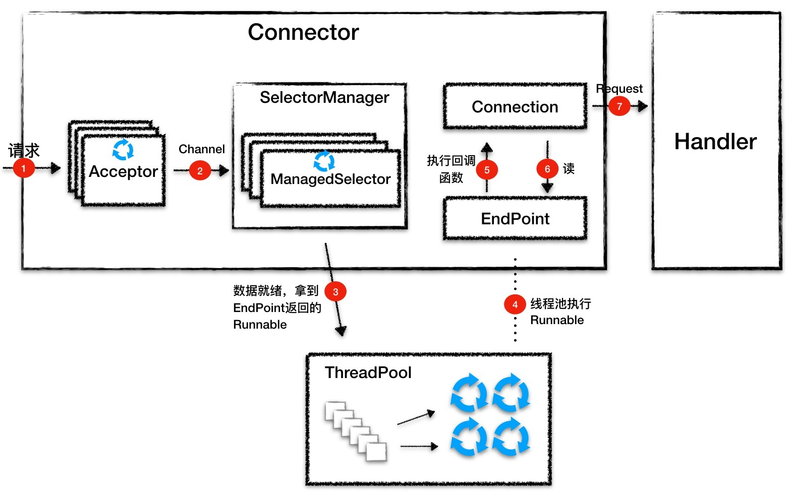

# 09 | 比较：Jetty架构特点之Connector组件
<audio src='./09-比较：Jetty架构特点之Connector组件.mp3' controls></audio>
经过专栏前面几期的学习，相信你对Tomcat的整体架构和工作原理有了基本了解。但是Servlet容器并非只有Tomcat一家，还有别的架构设计思路吗？今天我们就来看看Jetty的设计特点。

Jetty是Eclipse基金会的一个开源项目，和Tomcat一样，Jetty也是一个“HTTP服务器 + Servlet容器”，并且Jetty和Tomcat在架构设计上有不少相似的地方。但同时Jetty也有自己的特点，主要是更加小巧，更易于定制化。Jetty作为一名后起之秀，应用范围也越来越广，比如Google App Engine就采用了Jetty来作为Web容器。Jetty和Tomcat各有特点，所以今天我会和你重点聊聊Jetty在哪些地方跟Tomcat不同。通过比较它们的差异，一方面希望可以继续加深你对Web容器架构设计的理解，另一方面也让你更清楚它们的设计区别，并根据它们的特点来选用这两款Web容器。

## 鸟瞰Jetty整体架构

简单来说，Jetty Server就是由多个Connector（连接器）、多个Handler（处理器），以及一个线程池组成。整体结构请看下面这张图。


跟Tomcat一样，Jetty也有HTTP服务器和Servlet容器的功能，因此Jetty中的Connector组件和Handler组件分别来实现这两个功能，而这两个组件工作时所需要的线程资源都直接从一个全局线程池ThreadPool中获取。

Jetty Server可以有多个Connector在不同的端口上监听客户请求，而对于请求处理的Handler组件，也可以根据具体场景使用不同的Handler。这样的设计提高了Jetty的灵活性，需要支持Servlet，则可以使用ServletHandler；需要支持Session，则再增加一个SessionHandler。也就是说我们可以不使用Servlet或者Session，只要不配置这个Handler就行了。

为了启动和协调上面的核心组件工作，Jetty提供了一个Server类来做这个事情，它负责创建并初始化Connector、Handler、ThreadPool组件，然后调用start方法启动它们。

我们对比一下Tomcat的整体架构图，你会发现Tomcat在整体上跟Jetty很相似，它们的第一个区别是Jetty中没有Service的概念，Tomcat中的Service包装了多个连接器和一个容器组件，一个Tomcat实例可以配置多个Service，不同的Service通过不同的连接器监听不同的端口；而Jetty中Connector是被所有Handler共享的。


它们的第二个区别是，在Tomcat中每个连接器都有自己的线程池，而在Jetty中所有的Connector共享一个全局的线程池。

讲完了Jetty的整体架构，接下来我来详细分析Jetty的Connector组件的设计，下一期我将分析Handler组件的设计。

## Connector组件

跟Tomcat一样，Connector的主要功能是对I/O模型和应用层协议的封装。I/O模型方面，最新的Jetty 9版本只支持NIO，因此Jetty的Connector设计有明显的Java NIO通信模型的痕迹。至于应用层协议方面，跟Tomcat的Processor一样，Jetty抽象出了Connection组件来封装应用层协议的差异。

Java NIO早已成为程序员的必备技能，并且也经常出现在面试题中。接下来我们一起来看看Jetty是如何实现NIO模型的，以及它是怎么 **用** Java NIO的。

**Java NIO回顾**

关于Java NIO编程，如果你还不太熟悉，可以先学习这一 [系列文章](http://ifeve.com/java-nio-all/)。Java NIO的核心组件是Channel、Buffer和Selector。Channel表示一个连接，可以理解为一个Socket，通过它可以读取和写入数据，但是并不能直接操作数据，需要通过Buffer来中转。

Selector可以用来检测Channel上的I/O事件，比如读就绪、写就绪、连接就绪，一个Selector可以同时处理多个Channel，因此单个线程可以监听多个Channel，这样会大量减少线程上下文切换的开销。下面我们通过一个典型的服务端NIO程序来回顾一下如何使用这些组件。

首先，创建服务端Channel，绑定监听端口并把Channel设置为非阻塞方式。

```
ServerSocketChannel server = ServerSocketChannel.open();
server.socket().bind(new InetSocketAddress(port));
server.configureBlocking(false);

```

然后，创建Selector，并在Selector中注册Channel感兴趣的事件OP\_ACCEPT，告诉Selector如果客户端有新的连接请求到这个端口就通知我。

```
Selector selector = Selector.open();
server.register(selector, SelectionKey.OP_ACCEPT);

```

接下来，Selector会在一个死循环里不断地调用select去查询I/O状态，select会返回一个SelectionKey列表，Selector会遍历这个列表，看看是否有“客户”感兴趣的事件，如果有，就采取相应的动作。

比如下面这个例子，如果有新的连接请求，就会建立一个新的连接。连接建立后，再注册Channel的可读事件到Selector中，告诉Selector我对这个Channel上是否有新的数据到达感兴趣。

```
 while (true) {
        selector.select();//查询I/O事件
        for (Iterator<SelectionKey> i = selector.selectedKeys().iterator(); i.hasNext();) {
            SelectionKey key = i.next();
            i.remove();

            if (key.isAcceptable()) {
                // 建立一个新连接
                SocketChannel client = server.accept();
                client.configureBlocking(false);

                //连接建立后，告诉Selector，我现在对I/O可读事件感兴趣
                client.register(selector, SelectionKey.OP_READ);
            }
        }
    }

```

简单回顾完服务端NIO编程之后，你会发现服务端在I/O通信上主要完成了三件事情： **监听连接、I/O事件查询以及数据读写**。因此Jetty设计了 **Acceptor、SelectorManager和Connection来分别做这三件事情**，下面我分别来说说这三个组件。

**Acceptor**

顾名思义，Acceptor用于接受请求，跟Tomcat一样，Jetty也有独立的Acceptor线程组用于处理连接请求。在Connector的实现类ServerConnector中，有一个 `_acceptors` 的数组，在Connector启动的时候, 会根据 `_acceptors` 数组的长度创建对应数量的Acceptor，而Acceptor的个数可以配置。

```
for (int i = 0; i < _acceptors.length; i++)
{
  Acceptor a = new Acceptor(i);
  getExecutor().execute(a);
}

```

Acceptor是ServerConnector中的一个内部类，同时也是一个Runnable，Acceptor线程是通过getExecutor得到的线程池来执行的，前面提到这是一个全局的线程池。

Acceptor通过阻塞的方式来接受连接，这一点跟Tomcat也是一样的。

```
public void accept(int acceptorID) throws IOException
{
  ServerSocketChannel serverChannel = _acceptChannel;
  if (serverChannel != null && serverChannel.isOpen())
  {
    // 这里是阻塞的
    SocketChannel channel = serverChannel.accept();
    // 执行到这里时说明有请求进来了
    accepted(channel);
  }
}

```

接受连接成功后会调用accepted函数，accepted函数中会将SocketChannel设置为非阻塞模式，然后交给Selector去处理，因此这也就到了Selector的地界了。

```
private void accepted(SocketChannel channel) throws IOException
{
    channel.configureBlocking(false);
    Socket socket = channel.socket();
    configure(socket);
    // _manager是SelectorManager实例，里面管理了所有的Selector实例
    _manager.accept(channel);
}

```

**SelectorManager**

Jetty的Selector由SelectorManager类管理，而被管理的Selector叫作ManagedSelector。SelectorManager内部有一个ManagedSelector数组，真正干活的是ManagedSelector。咱们接着上面分析，看看在SelectorManager在accept方法里做了什么。

```
public void accept(SelectableChannel channel, Object attachment)
{
  //选择一个ManagedSelector来处理Channel
  final ManagedSelector selector = chooseSelector();
  //提交一个任务Accept给ManagedSelector
  selector.submit(selector.new Accept(channel, attachment));
}

```

SelectorManager从本身的Selector数组中选择一个Selector来处理这个Channel，并创建一个任务Accept交给ManagedSelector，ManagedSelector在处理这个任务主要做了两步：

第一步，调用Selector的register方法把Channel注册到Selector上，拿到一个SelectionKey。

```
 _key = _channel.register(selector, SelectionKey.OP_ACCEPT, this);

```

第二步，创建一个EndPoint和Connection，并跟这个SelectionKey（Channel）绑在一起：

```
private void createEndPoint(SelectableChannel channel, SelectionKey selectionKey) throws IOException
{
    //1. 创建EndPoint
    EndPoint endPoint = _selectorManager.newEndPoint(channel, this, selectionKey);

    //2. 创建Connection
    Connection connection = _selectorManager.newConnection(channel, endPoint, selectionKey.attachment());

    //3. 把EndPoint、Connection和SelectionKey绑在一起
    endPoint.setConnection(connection);
    selectionKey.attach(endPoint);

}

```

上面这两个过程是什么意思呢？打个比方，你到餐厅吃饭，先点菜（注册I/O事件），服务员（ManagedSelector）给你一个单子（SelectionKey），等菜做好了（I/O事件到了），服务员根据单子就知道是哪桌点了这个菜，于是喊一嗓子某某桌的菜做好了（调用了绑定在SelectionKey上的EndPoint的方法）。

这里需要你特别注意的是，ManagedSelector并没有调用直接EndPoint的方法去处理数据，而是通过调用EndPoint的方法 **返回一个Runnable，然后把这个Runnable扔给线程池执行**，所以你能猜到，这个Runnable才会去真正读数据和处理请求。

**Connection**

这个Runnable是EndPoint的一个内部类，它会调用Connection的回调方法来处理请求。Jetty的Connection组件类比就是Tomcat的Processor，负责具体协议的解析，得到Request对象，并调用Handler容器进行处理。下面我简单介绍一下它的具体实现类HttpConnection对请求和响应的处理过程。

**请求处理**：HttpConnection并不会主动向EndPoint读取数据，而是向在EndPoint中注册一堆回调方法：

```
getEndPoint().fillInterested(_readCallback);

```

这段代码就是告诉EndPoint，数据到了你就调我这些回调方法 `_readCallback` 吧，有点异步I/O的感觉，也就是说Jetty在应用层面模拟了异步I/O模型。

而在回调方法 `_readCallback` 里，会调用EndPoint的接口去读数据，读完后让HTTP解析器去解析字节流，HTTP解析器会将解析后的数据，包括请求行、请求头相关信息存到Request对象里。

**响应处理**：Connection调用Handler进行业务处理，Handler会通过Response对象来操作响应流，向流里面写入数据，HttpConnection再通过EndPoint把数据写到Channel，这样一次响应就完成了。

到此你应该了解了Connector的工作原理，下面我画张图再来回顾一下Connector的工作流程。



1.Acceptor监听连接请求，当有连接请求到达时就接受连接，一个连接对应一个Channel，Acceptor将Channel交给ManagedSelector来处理。

2.ManagedSelector把Channel注册到Selector上，并创建一个EndPoint和Connection跟这个Channel绑定，接着就不断地检测I/O事件。

3.I/O事件到了就调用EndPoint的方法拿到一个Runnable，并扔给线程池执行。

4.线程池中调度某个线程执行Runnable。

5.Runnable执行时，调用回调函数，这个回调函数是Connection注册到EndPoint中的。

6.回调函数内部实现，其实就是调用EndPoint的接口方法来读数据。

7.Connection解析读到的数据，生成请求对象并交给Handler组件去处理。

## 本期精华

Jetty Server就是由多个Connector、多个Handler，以及一个线程池组成，在设计上简洁明了。

Jetty的Connector只支持NIO模型，跟Tomcat的NioEndpoint组件一样，它也是通过Java的NIO API实现的。我们知道，Java NIO编程有三个关键组件：Channel、Buffer和Selector，而核心是Selector。为了方便使用，Jetty在原生Selector组件的基础上做了一些封装，实现了ManagedSelector组件。

在线程模型设计上Tomcat的NioEndpoint跟Jetty的Connector是相似的，都是用一个Acceptor数组监听连接，用一个Selector数组侦测I/O事件，用一个线程池执行请求。它们的不同点在于，Jetty使用了一个全局的线程池，所有的线程资源都是从线程池来分配。

Jetty Connector设计中的一大特点是，使用了回调函数来模拟异步I/O，比如Connection向EndPoint注册了一堆回调函数。它的本质 **将函数当作一个参数来传递**，告诉对方，你准备好了就调这个回调函数。

## 课后思考

Jetty的Connector主要完成了三件事件：接收连接、I/O事件查询以及数据读写。因此Jetty设计了Acceptor、SelectorManager和Connection来做这三件事情。今天的思考题是，为什么要把这些组件跑在不同的线程里呢？

不知道今天的内容你消化得如何？如果还有疑问，请大胆的在留言区提问，也欢迎你把你的课后思考和心得记录下来，与我和其他同学一起讨论。如果你觉得今天有所收获，欢迎你把它分享给你的朋友。