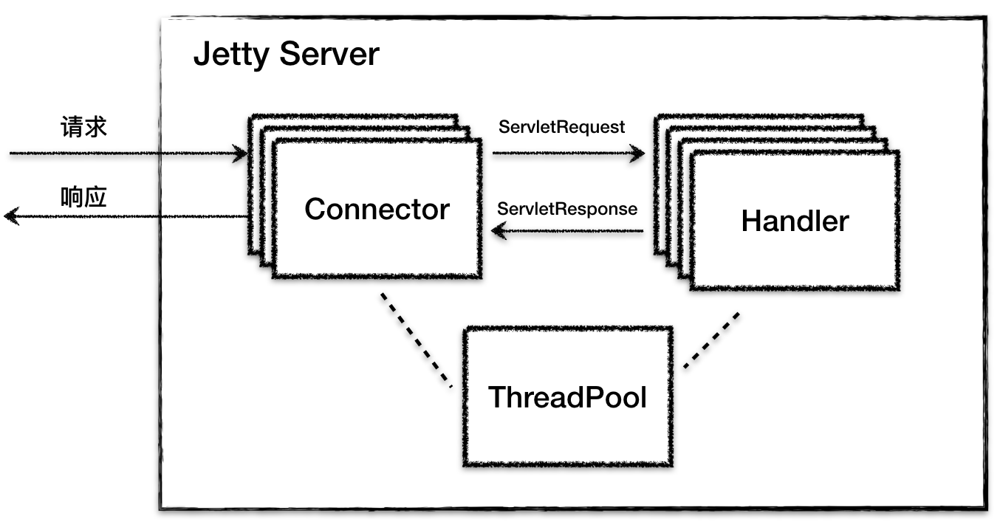
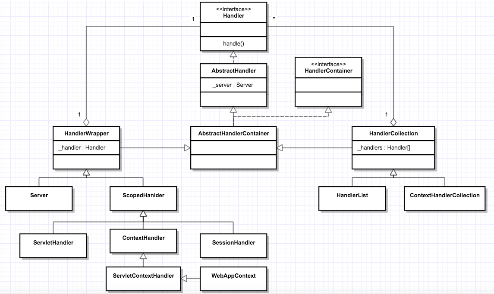

# 10 | 比较：Jetty架构特点之Handler组件
<audio src='./10-比较：Jetty架构特点之Handler组件.mp3' controls></audio>
在专栏上一期，我们学习了Jetty的整体架构。先来回顾一下，Jetty 就是由多个Connector（连接器）、多个Handler（处理器），以及一个线程池组成，整体结构图如下。



上一期我们分析了Jetty Connector组件的设计，Connector会将Servlet请求交给Handler去处理，那Handler又是如何处理请求的呢？

Jetty的Handler在设计上非常有意思，可以说是Jetty的灵魂，Jetty通过Handler实现了高度可定制化，那具体是如何实现的呢？我们能从中学到怎样的设计方法呢？接下来，我就来聊聊这些问题。

## Handler是什么

**Handler就是一个接口，它有一堆实现类**，Jetty的Connector组件调用这些接口来处理Servlet请求，我们先来看看这个接口定义成什么样子。

```
public interface Handler extends LifeCycle, Destroyable
{
    //处理请求的方法
    public void handle(String target, Request baseRequest, HttpServletRequest request, HttpServletResponse response)
        throws IOException, ServletException;

    //每个Handler都关联一个Server组件，被Server管理
    public void setServer(Server server);
    public Server getServer();

    //销毁方法相关的资源
    public void destroy();
}

```

你会看到Handler接口的定义非常简洁，主要就是用handle方法用来处理请求，跟Tomcat容器组件的service方法一样，它有ServletRequest和ServletResponse两个参数。除此之外，这个接口中还有setServer和getServer方法，因为任何一个Handler都需要关联一个Server组件，也就是说Handler需要被Server组件来管理。一般来说Handler会加载一些资源到内存，因此通过设置destroy方法来销毁。

**Handler继承关系**

Handler只是一个接口，完成具体功能的还是它的子类。那么Handler有哪些子类呢？它们的继承关系又是怎样的？这些子类是如何实现Servlet容器功能的呢？

Jetty中定义了一些默认Handler类，并且这些Handler类之间的继承关系比较复杂，我们先通过一个全景图来了解一下。为了避免让你感到不适，我对类图进行了简化。



从图上你可以看到，Handler的种类和层次关系还是比较复杂的：

Handler接口之下有抽象类AbstractHandler，这一点并不意外，因为有接口一般就有抽象实现类。

在AbstractHandler之下有AbstractHandlerContainer，为什么需要这个类呢？这其实是个过渡，为了实现链式调用，一个Handler内部必然要有其他Handler的引用，所以这个类的名字里才有Container，意思就是这样的Handler里包含了其他Handler的引用。

理解了上面的AbstractHandlerContainer，我们就能理解它的两个子类了：HandlerWrapper和HandlerCollection。简单来说就是，HandlerWrapper和HandlerCollection都是Handler，但是这些Handler里还包括其他Handler的引用。不同的是，HandlerWrapper只包含一个其他Handler的引用，而HandlerCollection中有一个Handler数组的引用。


接着来看左边的HandlerWrapper，它有两个子类：Server和ScopedHandler。Server比较好理解，它本身是Handler模块的入口，必然要将请求传递给其他Handler来处理，为了触发其他Handler的调用，所以它是一个HandlerWrapper。

再看ScopedHandler，它也是一个比较重要的Handler，实现了“具有上下文信息”的责任链调用。为什么我要强调“具有上下文信息”呢？那是因为Servlet规范规定Servlet在执行过程中是有上下文的。那么这些Handler在执行过程中如何访问这个上下文呢？这个上下文又存在什么地方呢？答案就是通过ScopedHandler来实现的。

而ScopedHandler有一堆的子类，这些子类就是用来实现Servlet规范的，比如ServletHandler、ContextHandler、SessionHandler、ServletContextHandler和WebAppContext。接下来我会详细介绍它们，但我们先把总体类图看完。

请看类图的右边，跟HandlerWrapper对等的还有HandlerCollection，HandlerCollection其实维护了一个Handler数组。你可能会问，为什么要发明一个这样的Handler？这是因为Jetty可能需要同时支持多个Web应用，如果每个Web应用有一个Handler入口，那么多个Web应用的Handler就成了一个数组，比如Server中就有一个HandlerCollection，Server会根据用户请求的URL从数组中选取相应的Handler来处理，就是选择特定的Web应用来处理请求。

**Handler的类型**

虽然从类图上看Handler有很多，但是本质上这些Handler分成三种类型：

- 第一种是 **协调Handler**，这种Handler负责将请求路由到一组Handler中去，比如上图中的HandlerCollection，它内部持有一个Handler数组，当请求到来时，它负责将请求转发到数组中的某一个Handler。
- 第二种是 **过滤器Handler**，这种Handler自己会处理请求，处理完了后再把请求转发到下一个Handler，比如图上的HandlerWrapper，它内部持有下一个Handler的引用。需要注意的是，所有继承了HandlerWrapper的Handler都具有了过滤器Handler的特征，比如ContextHandler、SessionHandler和WebAppContext等。
- 第三种是 **内容Handler**，说白了就是这些Handler会真正调用Servlet来处理请求，生成响应的内容，比如ServletHandler。如果浏览器请求的是一个静态资源，也有相应的ResourceHandler来处理这个请求，返回静态页面。

## 如何实现Servlet规范

上文提到，ServletHandler、ContextHandler以及WebAppContext等，它们实现了Servlet规范，那具体是怎么实现的呢？为了帮助你理解，在这之前，我们还是来看看如何使用Jetty来启动一个Web应用。

```
//新建一个WebAppContext，WebAppContext是一个Handler
WebAppContext webapp = new WebAppContext();
webapp.setContextPath("/mywebapp");
webapp.setWar("mywebapp.war");

//将Handler添加到Server中去
server.setHandler(webapp);

//启动Server
server.start();
server.join();

```

上面的过程主要分为两步：

第一步创建一个WebAppContext，接着设置一些参数到这个Handler中，就是告诉WebAppContext你的WAR包放在哪，Web应用的访问路径是什么。

第二步就是把新创建的WebAppContext添加到Server中，然后启动Server。

WebAppContext对应一个Web应用。我们回忆一下Servlet规范中有Context、Servlet、Filter、Listener和Session等，Jetty要支持Servlet规范，就需要有相应的Handler来分别实现这些功能。因此，Jetty设计了3个组件：ContextHandler、ServletHandler和SessionHandler来实现Servlet规范中规定的功能，而 **WebAppContext本身就是一个ContextHandler**，另外它还负责管理ServletHandler和SessionHandler。

我们再来看一下什么是ContextHandler。ContextHandler会创建并初始化Servlet规范里的ServletContext对象，同时ContextHandler还包含了一组能够让你的Web应用运行起来的Handler，可以这样理解，Context本身也是一种Handler，它里面包含了其他的Handler，这些Handler能处理某个特定URL下的请求。比如，ContextHandler包含了一个或者多个ServletHandler。

再来看ServletHandler，它实现了Servlet规范中的Servlet、Filter和Listener的功能。ServletHandler依赖FilterHolder、ServletHolder、ServletMapping、FilterMapping这四大组件。FilterHolder和ServletHolder分别是Filter和Servlet的包装类，每一个Servlet与路径的映射会被封装成ServletMapping，而Filter与拦截URL的映射会被封装成FilterMapping。

SessionHandler从名字就知道它的功能，用来管理Session。除此之外WebAppContext还有一些通用功能的Handler，比如SecurityHandler和GzipHandler，同样从名字可以知道这些Handler的功能分别是安全控制和压缩/解压缩。

WebAppContext会将这些Handler构建成一个执行链，通过这个链会最终调用到我们的业务Servlet。我们通过一张图来理解一下。


通过对比Tomcat的架构图，你可以看到，Jetty的Handler组件和Tomcat中的容器组件是大致是对等的概念，Jetty中的WebAppContext相当于Tomcat的Context组件，都是对应一个Web应用；而Jetty中的ServletHandler对应Tomcat中的Wrapper组件，它负责初始化和调用Servlet，并实现了Filter的功能。

对于一些通用组件，比如安全和解压缩，在Jetty中都被做成了Handler，这是Jetty Handler架构的特点。

因此对于Jetty来说，请求处理模块就被抽象成Handler，不管是实现了Servlet规范的Handler，还是实现通用功能的Handler，比如安全、解压缩等，我们可以任意添加或者裁剪这些“功能模块”，从而实现高度的可定制化。

## 本期精华

Jetty Server就是由多个Connector、多个Handler，以及一个线程池组成。

Jetty的Handler设计是它的一大特色，Jetty本质就是一个Handler管理器，Jetty本身就提供了一些默认Handler来实现Servlet容器的功能，你也可以定义自己的Handler来添加到Jetty中，这体现了“ **微内核 \+ 插件**”的设计思想。

## 课后思考

通过今天的学习，我们知道各种Handler都会对请求做一些处理，再将请求传给下一个Handler，而Servlet也是用来处理请求的，那Handler跟Servlet有什么区别呢？

不知道今天的内容你消化得如何？如果还有疑问，请大胆的在留言区提问，也欢迎你把你的课后思考和心得记录下来，与我和其他同学一起讨论。如果你觉得今天有所收获，欢迎你把它分享给你的朋友。