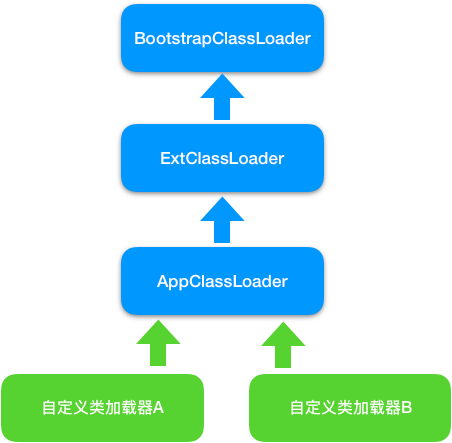

# 24 | Context容器（上）：Tomcat如何打破双亲委托机制？
<audio src='./24-Context容器（上）：Tomcat如何打破双亲委托机制？.mp3' controls></audio>
相信我们平时在工作中都遇到过ClassNotFound异常，这个异常表示JVM在尝试加载某个类的时候失败了。想要解决这个问题，首先你需要知道什么是类加载，JVM是如何加载类的，以及为什么会出现ClassNotFound异常？弄懂上面这些问题之后，我们接着要思考Tomcat作为Web容器，它是如何加载和管理Web应用下的Servlet呢？

Tomcat正是通过Context组件来加载管理Web应用的，所以今天我会详细分析Tomcat的类加载机制。但在这之前，我们有必要预习一下JVM的类加载机制，我会先回答一下一开始抛出来的问题，接着再谈谈Tomcat的类加载器如何打破Java的双亲委托机制。

## JVM的类加载器

Java的类加载，就是把字节码格式“.class”文件加载到JVM的 **方法区**，并在JVM的 **堆区** 建立一个 `java.lang.Class` 对象的实例，用来封装Java类相关的数据和方法。那Class对象又是什么呢？你可以把它理解成业务类的模板，JVM根据这个模板来创建具体业务类对象实例。

JVM并不是在启动时就把所有的“.class”文件都加载一遍，而是程序在运行过程中用到了这个类才去加载。JVM类加载是由类加载器来完成的，JDK提供一个抽象类ClassLoader，这个抽象类中定义了三个关键方法，理解清楚它们的作用和关系非常重要。

```
public abstract class ClassLoader {

    //每个类加载器都有个父加载器
    private final ClassLoader parent;

    public Class<?> loadClass(String name) {

        //查找一下这个类是不是已经加载过了
        Class<?> c = findLoadedClass(name);

        //如果没有加载过
        if( c == null ){
          //先委托给父加载器去加载，注意这是个递归调用
          if (parent != null) {
              c = parent.loadClass(name);
          }else {
              // 如果父加载器为空，查找Bootstrap加载器是不是加载过了
              c = findBootstrapClassOrNull(name);
          }
        }
        // 如果父加载器没加载成功，调用自己的findClass去加载
        if (c == null) {
            c = findClass(name);
        }

        return c；
    }

    protected Class<?> findClass(String name){
       //1. 根据传入的类名name，到在特定目录下去寻找类文件，把.class文件读入内存
          ...

       //2. 调用defineClass将字节数组转成Class对象
       return defineClass(buf, off, len)；
    }

    // 将字节码数组解析成一个Class对象，用native方法实现
    protected final Class<?> defineClass(byte[] b, int off, int len){
       ...
    }
}

```

从上面的代码我们可以得到几个关键信息：

- JVM的类加载器是分层次的，它们有父子关系，每个类加载器都持有一个parent字段，指向父加载器。
- defineClass是个工具方法，它的职责是调用native方法把Java类的字节码解析成一个Class对象，所谓的native方法就是由C语言实现的方法，Java通过JNI机制调用。
- findClass方法的主要职责就是找到“.class”文件，可能来自文件系统或者网络，找到后把“.class”文件读到内存得到字节码数组，然后调用defineClass方法得到Class对象。
- loadClass是个public方法，说明它才是对外提供服务的接口，具体实现也比较清晰：首先检查这个类是不是已经被加载过了，如果加载过了直接返回，否则交给父加载器去加载。请你注意，这是一个递归调用，也就是说子加载器持有父加载器的引用，当一个类加载器需要加载一个Java类时，会先委托父加载器去加载，然后父加载器在自己的加载路径中搜索Java类，当父加载器在自己的加载范围内找不到时，才会交还给子加载器加载，这就是双亲委托机制。

JDK中有哪些默认的类加载器？它们的本质区别是什么？为什么需要双亲委托机制？JDK中有3个类加载器，另外你也可以自定义类加载器，它们的关系如下图所示。



- BootstrapClassLoader是启动类加载器，由C语言实现，用来加载JVM启动时所需要的核心类，比如 `rt.jar`、 `resources.jar` 等。
- ExtClassLoader是扩展类加载器，用来加载 `\jre\lib\ext` 目录下JAR包。
- AppClassLoader是系统类加载器，用来加载classpath下的类，应用程序默认用它来加载类。
- 自定义类加载器，用来加载自定义路径下的类。

这些类加载器的工作原理是一样的，区别是它们的加载路径不同，也就是说findClass这个方法查找的路径不同。双亲委托机制是为了保证一个Java类在JVM中是唯一的，假如你不小心写了一个与JRE核心类同名的类，比如Object类，双亲委托机制能保证加载的是JRE里的那个Object类，而不是你写的Object类。这是因为AppClassLoader在加载你的Object类时，会委托给ExtClassLoader去加载，而ExtClassLoader又会委托给BootstrapClassLoader，BootstrapClassLoader发现自己已经加载过了Object类，会直接返回，不会去加载你写的Object类。

这里请你注意，类加载器的父子关系不是通过继承来实现的，比如AppClassLoader并不是ExtClassLoader的子类，而是说AppClassLoader的parent成员变量指向ExtClassLoader对象。同样的道理，如果你要自定义类加载器，不去继承AppClassLoader，而是继承ClassLoader抽象类，再重写findClass和loadClass方法即可，Tomcat就是通过自定义类加载器来实现自己的类加载逻辑。不知道你发现没有，如果你要打破双亲委托机制，就需要重写loadClass方法，因为loadClass的默认实现就是双亲委托机制。

## Tomcat的类加载器

Tomcat的自定义类加载器WebAppClassLoader打破了双亲委托机制，它 **首先自己尝试去加载某个类，如果找不到再代理给父类加载器**，其目的是优先加载Web应用自己定义的类。具体实现就是重写ClassLoader的两个方法：findClass和loadClass。

**findClass方法**

我们先来看看findClass方法的实现，为了方便理解和阅读，我去掉了一些细节：

```
public Class<?> findClass(String name) throws ClassNotFoundException {
    ...

    Class<?> clazz = null;
    try {
            //1. 先在Web应用目录下查找类
            clazz = findClassInternal(name);
    }  catch (RuntimeException e) {
           throw e;
       }

    if (clazz == null) {
    try {
            //2. 如果在本地目录没有找到，交给父加载器去查找
            clazz = super.findClass(name);
    }  catch (RuntimeException e) {
           throw e;
       }

    //3. 如果父类也没找到，抛出ClassNotFoundException
    if (clazz == null) {
        throw new ClassNotFoundException(name);
     }

    return clazz;
}

```

在findClass方法里，主要有三个步骤：

1. 先在Web应用本地目录下查找要加载的类。
2. 如果没有找到，交给父加载器去查找，它的父加载器就是上面提到的系统类加载器AppClassLoader。
3. 如何父加载器也没找到这个类，抛出ClassNotFound异常。

**loadClass方法**

接着我们再来看Tomcat类加载器的loadClass方法的实现，同样我也去掉了一些细节：

```
public Class<?> loadClass(String name, boolean resolve) throws ClassNotFoundException {

    synchronized (getClassLoadingLock(name)) {

        Class<?> clazz = null;

        //1. 先在本地cache查找该类是否已经加载过
        clazz = findLoadedClass0(name);
        if (clazz != null) {
            if (resolve)
                resolveClass(clazz);
            return clazz;
        }

        //2. 从系统类加载器的cache中查找是否加载过
        clazz = findLoadedClass(name);
        if (clazz != null) {
            if (resolve)
                resolveClass(clazz);
            return clazz;
        }

        // 3. 尝试用ExtClassLoader类加载器类加载，为什么？
        ClassLoader javaseLoader = getJavaseClassLoader();
        try {
            clazz = javaseLoader.loadClass(name);
            if (clazz != null) {
                if (resolve)
                    resolveClass(clazz);
                return clazz;
            }
        } catch (ClassNotFoundException e) {
            // Ignore
        }

        // 4. 尝试在本地目录搜索class并加载
        try {
            clazz = findClass(name);
            if (clazz != null) {
                if (resolve)
                    resolveClass(clazz);
                return clazz;
            }
        } catch (ClassNotFoundException e) {
            // Ignore
        }

        // 5. 尝试用系统类加载器(也就是AppClassLoader)来加载
            try {
                clazz = Class.forName(name, false, parent);
                if (clazz != null) {
                    if (resolve)
                        resolveClass(clazz);
                    return clazz;
                }
            } catch (ClassNotFoundException e) {
                // Ignore
            }
       }

    //6. 上述过程都加载失败，抛出异常
    throw new ClassNotFoundException(name);
}

```

loadClass方法稍微复杂一点，主要有六个步骤：

1. 先在本地Cache查找该类是否已经加载过，也就是说Tomcat的类加载器是否已经加载过这个类。
2. 如果Tomcat类加载器没有加载过这个类，再看看系统类加载器是否加载过。
3. 如果都没有，就让 **ExtClassLoader** 去加载，这一步比较关键，目的 **防止Web应用自己的类覆盖JRE的核心类**。因为Tomcat需要打破双亲委托机制，假如Web应用里自定义了一个叫Object的类，如果先加载这个Object类，就会覆盖JRE里面的那个Object类，这就是为什么Tomcat的类加载器会优先尝试用ExtClassLoader去加载，因为ExtClassLoader会委托给BootstrapClassLoader去加载，BootstrapClassLoader发现自己已经加载了Object类，直接返回给Tomcat的类加载器，这样Tomcat的类加载器就不会去加载Web应用下的Object类了，也就避免了覆盖JRE核心类的问题。
4. 如果ExtClassLoader加载器加载失败，也就是说JRE核心类中没有这类，那么就在本地Web应用目录下查找并加载。
5. 如果本地目录下没有这个类，说明不是Web应用自己定义的类，那么由系统类加载器去加载。这里请你注意，Web应用是通过 `Class.forName` 调用交给系统类加载器的，因为 `Class.forName` 的默认加载器就是系统类加载器。
6. 如果上述加载过程全部失败，抛出ClassNotFound异常。

从上面的过程我们可以看到，Tomcat的类加载器打破了双亲委托机制，没有一上来就直接委托给父加载器，而是先在本地目录下加载，为了避免本地目录下的类覆盖JRE的核心类，先尝试用JVM扩展类加载器ExtClassLoader去加载。那为什么不先用系统类加载器AppClassLoader去加载？很显然，如果是这样的话，那就变成双亲委托机制了，这就是Tomcat类加载器的巧妙之处。

## 本期精华

今天我介绍了JVM的类加载器原理和源码剖析，以及Tomcat的类加载器是如何打破双亲委托机制的，目的是为了优先加载Web应用目录下的类，然后再加载其他目录下的类，这也是Servlet规范的推荐做法。

要打破双亲委托机制，需要继承ClassLoader抽象类，并且需要重写它的loadClass方法，因为ClassLoader的默认实现就是双亲委托。

## 课后思考

如果你并不想打破双亲委托机制，但是又想定义自己的类加载器来加载特定目录下的类，你需要重写findClass和loadClass方法中的哪一个？还是两个都要重写？

不知道今天的内容你消化得如何？如果还有疑问，请大胆的在留言区提问，也欢迎你把你的课后思考和心得记录下来，与我和其他同学一起讨论。如果你觉得今天有所收获，欢迎你把它分享给你的朋友。